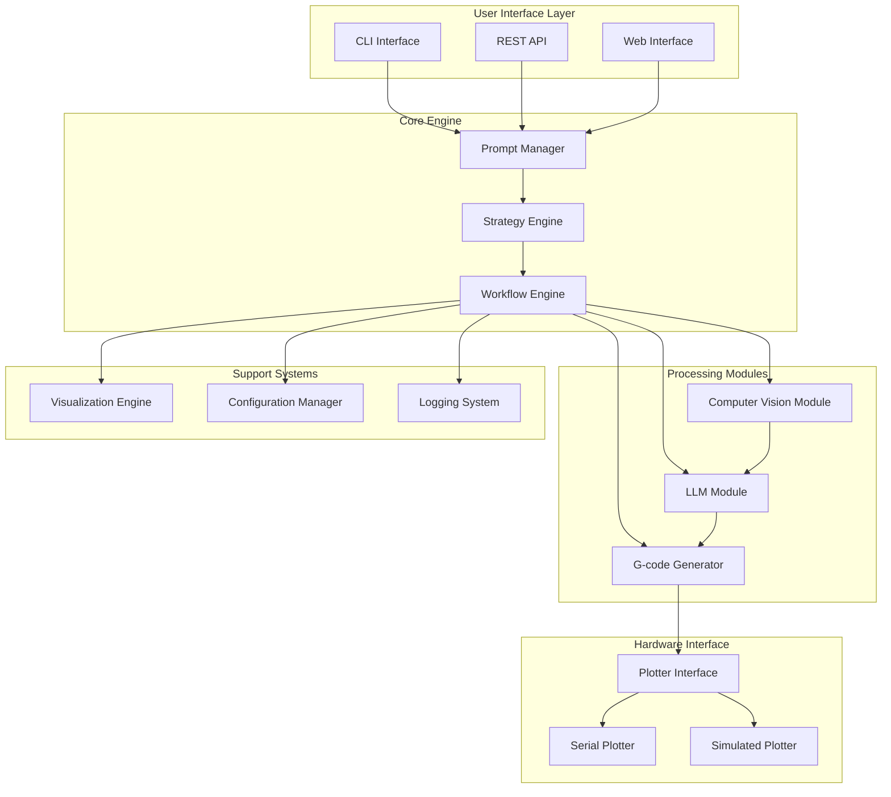

# Design Document

## Overview

PromptPlot v2.0 is a modular, extensible pen plotter control system that transforms natural language prompts into G-code instructions through intelligent LLM processing and computer vision feedback. The system employs a dual-strategy approach for handling both orthogonal (straight-line) and non-orthogonal (curved) drawing patterns, while incorporating real-time visual feedback to optimize drawing decisions.

The architecture follows a clean separation of concerns with distinct modules for core functionality, LLM processing, computer vision, plotter communication, and visualization. This design enables easy extension, testing, and maintenance while preserving the robust workflow-based approach of the current system.

## Architecture

### High-Level Architecture



### Module Structure (Based on Current Codebase Analysis)

From analyzing the existing files, I can see they share common patterns:
- **Workflow-based architecture** using LlamaIndex workflows
- **Pydantic models** for G-code validation (`GCodeCommand`, `GCodeProgram`)
- **LLM providers** (Ollama, Azure OpenAI)
- **Plotter interfaces** (Real serial, Simulated)
- **Visualization** (matplotlib-based, HTML workflow diagrams)
- **Different complexity levels** (simple vs advanced, batch vs streaming)

**Proposed Refactored Structure:**
```
promptplot/
├── __init__.py
├── core/
│   ├── __init__.py
│   ├── models.py              # Shared Pydantic models (GCodeCommand, etc.)
│   ├── exceptions.py          # Custom exceptions (extracted from current files)
│   └── base_workflow.py       # Base workflow class with common functionality
├── workflows/
│   ├── __init__.py
│   ├── simple_batch.py        # Refactored from generate_llm_simple.py
│   ├── advanced_sequential.py # Refactored from generate_llm_advanced.py
│   ├── simple_streaming.py    # Refactored from llm_stream_simple.py
│   ├── advanced_streaming.py  # Refactored from llm_stream_advanced.py
│   └── vision_enhanced.py     # New: workflows with computer vision
├── llm/
│   ├── __init__.py
│   ├── providers.py           # Abstracted LLM providers (OpenAI, Ollama)
│   ├── templates.py           # Prompt templates (extracted from current files)
│   └── vision_llm.py          # New: LLM + vision integration
├── plotter/
│   ├── __init__.py
│   ├── base.py                # Base plotter interface (extracted pattern)
│   ├── serial_plotter.py      # Real hardware (from current AsyncController)
│   ├── simulated.py           # Simulated plotter (enhanced from current)
│   └── visualizer.py          # Matplotlib visualization (extracted)
├── strategies/
│   ├── __init__.py
│   ├── orthogonal.py          # New: straight lines, rectangles, grids
│   └── non_orthogonal.py      # New: curves, circles, complex shapes
├── vision/
│   ├── __init__.py
│   ├── capture.py             # Camera interface
│   ├── processor.py           # Image analysis
│   └── feedback.py            # Visual feedback integration
└── utils/
    ├── __init__.py
    ├── config.py              # Configuration management
    └── logging.py             # Logging utilities
```

**Migration Strategy from Current Files:**
1. **Extract Common Components**: Models, exceptions, base classes
2. **Refactor Workflows**: Keep existing workflow logic but make it modular
3. **Abstract LLM Providers**: Create unified interface for different LLM services
4. **Enhance Plotter Interface**: Build on existing serial/simulated pattern
5. **Add New Features**: Vision integration, strategy selection

## Components and Interfaces

### Core Components (Extracted from Current Codebase)

#### Base Workflow (Common Pattern from Existing Files)
```python
class BasePromptPlotWorkflow(Workflow):
    """Base class extracting common patterns from existing workflows"""
    
    def __init__(self, llm: Any, plotter: BasePlotter, max_retries: int = 3, max_steps: int = 50):
        """Common initialization pattern from all current workflows"""
        super().__init__()
        self.llm = llm
        self.plotter = plotter
        self.max_retries = max_retries
        self.max_steps = max_steps
    
    async def validate_gcode_command(self, output: str) -> Union[GCodeCommand, ValidationError]:
        """Common validation logic extracted from all workflows"""
        # Extract JSON parsing and GCodeCommand validation logic
        
    async def handle_retry_with_reflection(self, error: str, wrong_answer: str) -> str:
        """Common retry pattern with reflection prompts"""
        # Extract reflection prompt logic from existing files
```

#### Strategy Selection (New Component)
```python
class StrategySelector:
    """Determines drawing strategy based on prompt analysis"""
    
    def analyze_prompt_complexity(self, prompt: str) -> PromptComplexity:
        """Analyze if prompt requires orthogonal or non-orthogonal approach"""
        
    def select_workflow(self, complexity: PromptComplexity) -> Type[BasePromptPlotWorkflow]:
        """Select appropriate workflow class based on complexity"""
        
class OrthogonalStrategy:
    """Optimized for straight lines, rectangles, grids"""
    
    def generate_optimized_commands(self, shapes: List[Shape]) -> List[GCodeCommand]:
        """Generate efficient commands for geometric shapes"""

class NonOrthogonalStrategy:
    """Handles curves, organic shapes, complex paths"""
    
    def generate_curve_approximation(self, path: Path) -> List[GCodeCommand]:
        """Generate G-code for complex curved paths"""
```

### LLM Integration (Enhanced from Current Implementation)

#### LLM Provider Abstraction (Based on Current Usage)
```python
class LLMProvider(ABC):
    """Abstract base for LLM providers - extracted from current dual usage"""
    
    @abstractmethod
    async def acomplete(self, prompt: str) -> str:
        """Async completion - pattern from current workflows"""
        
    @abstractmethod
    def complete(self, prompt: str) -> str:
        """Sync completion - pattern from current workflows"""

class AzureOpenAIProvider(LLMProvider):
    """Azure OpenAI provider - currently used in existing files"""
    
    def __init__(self, model: str, deployment_name: str, api_key: str, 
                 api_version: str, azure_endpoint: str, timeout: int = 1220):
        # Extract current configuration pattern
        
class OllamaProvider(LLMProvider):
    """Ollama provider - currently used as fallback"""
    
    def __init__(self, model: str = "llama3.2:3b", request_timeout: int = 10000):
        # Extract current configuration pattern
```

#### Vision-Enhanced LLM (New Feature)
```python
class VisionEnhancedLLM:
    """LLM with computer vision integration using LlamaIndex patterns"""
    
    def __init__(self, base_llm: LLMProvider):
        self.base_llm = base_llm
    
    async def generate_with_visual_context(
        self, 
        prompt: str, 
        images: List[str],  # image URLs or paths
        history: List[GCodeCommand]
    ) -> str:
        """Generate G-code using LlamaIndex ChatMessage with ImageBlock"""
        from llama_index.core.llms import ChatMessage, ImageBlock, TextBlock, MessageRole
        
        # Build message with text and images
        blocks = [TextBlock(text=prompt)]
        for image_url in images:
            blocks.append(ImageBlock(url=image_url))
            
        msg = ChatMessage(role=MessageRole.USER, blocks=blocks)
        response = await self.base_llm.chat(messages=[msg])
        return response.message.content
```

### Computer Vision Module

#### Camera Interface
```python
class CameraInterface:
    """Interface for camera/image capture"""
    
    async def capture_image(self) -> Image:
        """Capture single image from camera"""
        
    async def start_continuous_capture(self, interval: float) -> AsyncGenerator[Image]:
        """Start continuous image capture"""
        
    def set_capture_area(self, bounds: Rectangle) -> None:
        """Set specific area for capture"""
```

#### Image Processor
```python
class ImageProcessor:
    """Processes and analyzes images"""
    
    def preprocess_image(self, image: Image) -> Image:
        """Preprocess image for analysis"""
        
    def extract_drawing_features(self, image: Image) -> DrawingFeatures:
        """Extract relevant drawing features from image"""
        
    def compare_images(self, before: Image, after: Image) -> ImageDiff:
        """Compare two images to detect changes"""
```

#### Feedback Analyzer
```python
class FeedbackAnalyzer:
    """Analyzes visual feedback for drawing decisions"""
    
    def analyze_progress(
        self, 
        target_intent: DrawingIntent, 
        current_image: Image
    ) -> ProgressFeedback:
        """Analyze drawing progress"""
        
    def suggest_next_action(
        self, 
        feedback: ProgressFeedback, 
        history: List[GCodeCommand]
    ) -> ActionSuggestion:
        """Suggest next drawing action based on feedback"""
```

### G-code Generation

#### Enhanced G-code Generator
```python
class GCodeGenerator:
    """Generates optimized G-code commands"""
    
    def generate_command(
        self, 
        intent: DrawingIntent, 
        strategy: DrawingStrategy,
        visual_context: Optional[VisualContext] = None
    ) -> GCodeCommand:
        """Generate single G-code command"""
        
    def optimize_path(self, commands: List[GCodeCommand]) -> List[GCodeCommand]:
        """Optimize command sequence for efficiency"""
        
    def validate_sequence(self, commands: List[GCodeCommand]) -> ValidationResult:
        """Validate command sequence for safety and correctness"""
```

### Plotter Interface (Enhanced from Current Implementation)

#### Base Plotter Interface (Extracted Pattern)
```python
class BasePlotter(ABC):
    """Base interface extracted from current RealPenPlotter and SimulatedPenPlotter"""
    
    @abstractmethod
    async def connect(self) -> bool:
        """Connect to plotter - pattern from current implementations"""
        
    @abstractmethod
    async def disconnect(self) -> None:
        """Disconnect from plotter - pattern from current implementations"""
        
    @abstractmethod
    async def send_command(self, command: str) -> bool:
        """Send G-code command - current interface"""
        
    async def __aenter__(self):
        """Context manager support - current pattern"""
        await self.connect()
        return self
        
    async def __aexit__(self, exc_type, exc, tb):
        """Context manager support - current pattern"""
        await self.disconnect()

class SerialPlotter(BasePlotter):
    """Real hardware plotter - enhanced from current AsyncController"""
    
    def __init__(self, port: str, baud_rate: int = 115200):
        # Extract current AsyncController initialization
        self.port = port
        self.baud_rate = baud_rate
        self.reader = None
        self.writer = None
        
    async def send_command(self, command: str) -> bool:
        """Enhanced from current send_signal method"""
        # Extract current serial communication logic

class SimulatedPlotter(BasePlotter):
    """Enhanced simulated plotter with visualization"""
    
    def __init__(self, port: str = "SIMULATED", visualize: bool = True):
        # Extract current SimulatedPenPlotter initialization
        self.visualizer = PlotterVisualizer() if visualize else None
        
    async def send_command(self, command: str) -> bool:
        """Enhanced from current simulation with better visualization"""
        # Extract and enhance current simulation logic
```

## Data Models

### Core Data Models
```python
@dataclass
class PromptAnalysis:
    """Analysis results of user prompt"""
    drawing_type: DrawingType
    complexity_level: ComplexityLevel
    estimated_commands: int
    requires_curves: bool
    suggested_strategy: DrawingStrategy

@dataclass
class DrawingIntent:
    """Specific drawing intentions extracted from prompt"""
    shapes: List[Shape]
    coordinates: List[Coordinate]
    drawing_order: List[int]
    pen_settings: PenSettings

@dataclass
class VisualContext:
    """Visual context for G-code generation"""
    current_image: Image
    drawing_progress: float
    detected_features: List[Feature]
    suggested_corrections: List[Correction]

@dataclass
class ExecutionResult:
    """Result of command execution"""
    success: bool
    response_time: float
    plotter_response: str
    error_message: Optional[str]
```

### Enhanced G-code Models
```python
class GCodeCommand(BaseModel):
    """Enhanced G-code command model"""
    command: str
    x: Optional[float] = None
    y: Optional[float] = None
    z: Optional[float] = None
    f: Optional[int] = None
    s: Optional[int] = None
    p: Optional[int] = None
    
    # New fields for v2.0
    strategy_type: Optional[DrawingStrategy] = None
    visual_context_id: Optional[str] = None
    confidence_score: Optional[float] = None
    
    @field_validator('command')
    @classmethod
    def validate_command(cls, v):
        """Enhanced validation with strategy awareness"""
        # Existing validation plus strategy-specific checks
        pass
```

## Error Handling

### Exception Hierarchy
```python
class PromptPlotException(Exception):
    """Base exception for PromptPlot system"""
    pass

class LLMException(PromptPlotException):
    """LLM-related errors"""
    pass

class VisionException(PromptPlotException):
    """Computer vision errors"""
    pass

class PlotterException(PromptPlotException):
    """Plotter communication errors"""
    pass

class ValidationException(PromptPlotException):
    """G-code validation errors"""
    pass
```

### Error Recovery Strategies
1. **LLM Failures**: Automatic retry with reflection prompts, fallback to simpler strategies
2. **Vision Failures**: Continue without visual feedback, use last known good state
3. **Plotter Failures**: Automatic reconnection, command queue preservation
4. **Validation Failures**: Command correction attempts, safe fallback commands

## Testing Strategy

### Unit Testing
- Individual component testing with mocks
- G-code validation and generation testing
- Strategy selection algorithm testing
- Image processing pipeline testing

### Integration Testing
- End-to-end workflow testing with simulated plotter
- LLM + Vision integration testing
- Real hardware testing with controlled scenarios
- Performance testing with complex drawings

### Visual Testing
- Drawing accuracy validation through image comparison
- Progress tracking accuracy testing
- Visualization component testing
- Real-time feedback loop testing

## Performance Considerations

### Optimization Strategies
1. **Command Generation**: Batch processing for orthogonal strategies, streaming for complex shapes
2. **Image Processing**: Efficient preprocessing pipelines, selective feature extraction
3. **Memory Management**: Image buffer management, command history pruning
4. **Network Efficiency**: Optimized LLM API calls, image compression for vision APIs

### Scalability Features
1. **Concurrent Processing**: Parallel image analysis and command generation
2. **Caching**: LLM response caching, processed image caching
3. **Resource Management**: Configurable resource limits, automatic cleanup
4. **Monitoring**: Performance metrics collection, bottleneck identification