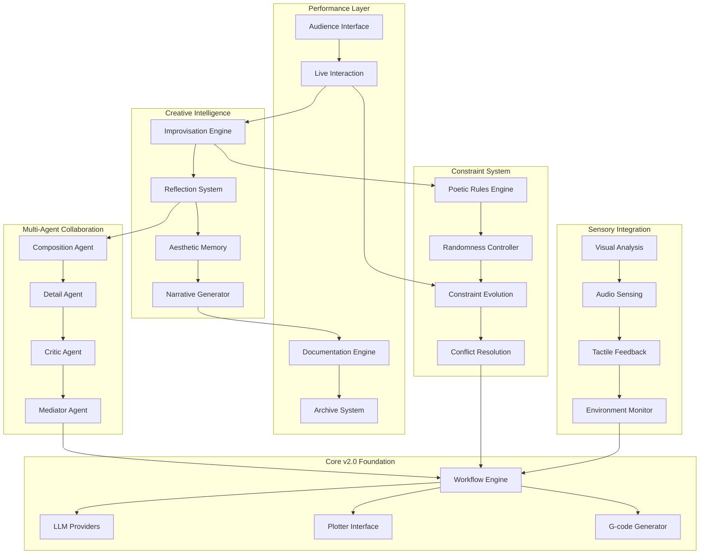
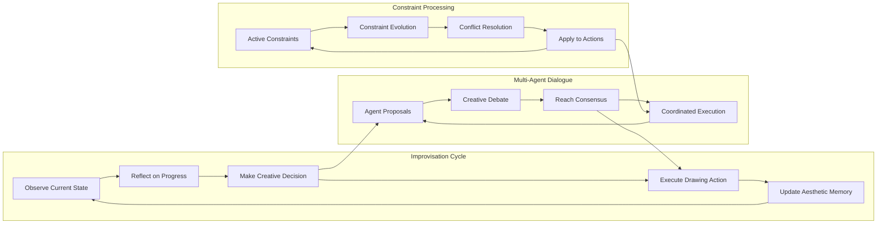

# Design Document

## Overview

PromptPlot v3.0 transforms the pen plotter from a mere drawing tool into an autonomous creative agent capable of improvisation, self-reflection, and live performance. Building on v2.0's solid technical foundation, this version introduces a constraint-based creative engine, multi-agent collaboration system, and real-time audience interaction capabilities. The system treats each drawing as a unique performance where constraints become creative catalysts, imperfections become artistic features, and the machine develops its own aesthetic voice through continuous learning and reflection.

The architecture embraces the concept of "machine as artist" rather than "machine as tool," implementing creative decision-making processes, aesthetic memory, and emergent narrative generation that make each drawing session a unique artistic event.

## Architecture

### High-Level Architecture



### Creative Intelligence Architecture

The creative intelligence system forms the core of v3.0's artistic capabilities:



## Components and Interfaces

### Creative Intelligence Components

#### Improvisation Engine
```python
class ImprovisationEngine:
    """Core creative decision-making system"""
    
    def __init__(self, aesthetic_memory: AestheticMemory, constraint_system: ConstraintSystem):
        self.aesthetic_memory = aesthetic_memory
        self.constraint_system = constraint_system
        self.improvisation_state = ImprovisationState()
        self.reflection_cycles = 0
        
    async def improvise_next_action(
        self, 
        current_drawing_state: DrawingState,
        audience_input: Optional[AudienceInput] = None
    ) -> CreativeAction:
        """Generate next creative action through improvisation"""
        
        # Observe current state
        observation = await self.observe_current_state(current_drawing_state)
        
        # Reflect on progress and aesthetic choices
        reflection = await self.reflect_on_progress(observation)
        
        # Generate creative decision considering constraints and memory
        decision = await self.make_creative_decision(reflection, audience_input)
        
        # Update aesthetic memory with decision rationale
        await self.aesthetic_memory.record_decision(decision, reflection)
        
        return decision.to_creative_action()
    
    async def self_critique_and_adjust(self, recent_actions: List[CreativeAction]) -> CritiqueResult:
        """Self-reflection and critique system"""
        critique_prompt = f"""
        Analyze these recent drawing actions and provide artistic critique:
        {recent_actions}
        
        Consider:
        - Aesthetic coherence
        - Constraint adherence
        - Creative risk-taking
        - Compositional balance
        
        Suggest adjustments for future actions.
        """
        
        critique = await self.llm.generate_critique(critique_prompt)
        return CritiqueResult.from_llm_response(critique)
```

#### Aesthetic Memory System
```python
class AestheticMemory:
    """Long-term aesthetic learning and preference development"""
    
    def __init__(self):
        self.preference_weights = {}
        self.successful_patterns = []
        self.aesthetic_evolution = []
        self.style_consistency_score = 0.0
        
    async def record_decision(self, decision: CreativeDecision, context: ReflectionContext):
        """Record creative decision with context for learning"""
        decision_record = AestheticDecisionRecord(
            decision=decision,
            context=context,
            timestamp=datetime.now(),
            constraint_state=context.active_constraints,
            audience_reaction=context.audience_feedback
        )
        
        # Update preference weights based on decision outcomes
        await self.update_preferences(decision_record)
        
        # Track aesthetic evolution over time
        self.aesthetic_evolution.append(decision_record)
        
    async def get_aesthetic_guidance(self, current_context: DrawingContext) -> AestheticGuidance:
        """Provide aesthetic guidance based on learned preferences"""
        similar_contexts = self.find_similar_contexts(current_context)
        successful_patterns = self.extract_successful_patterns(similar_contexts)
        
        return AestheticGuidance(
            preferred_actions=successful_patterns,
            style_consistency_weight=self.style_consistency_score,
            novelty_encouragement=self.calculate_novelty_need(current_context)
        )
    
    def develop_artistic_voice(self) -> ArtisticVoice:
        """Analyze accumulated decisions to identify emerging artistic voice"""
        pattern_analysis = self.analyze_decision_patterns()
        style_evolution = self.track_style_evolution()
        
        return ArtisticVoice(
            dominant_patterns=pattern_analysis.dominant_patterns,
            style_trajectory=style_evolution,
            signature_elements=pattern_analysis.recurring_elements,
            creative_risk_profile=self.calculate_risk_profile()
        )
```

### Constraint System Components

#### Poetic Rules Engine
```python
class PoeticRulesEngine:
    """Implements and manages poetic constraints"""
    
    def __init__(self):
        self.active_constraints = []
        self.constraint_history = []
        self.conflict_resolver = ConstraintConflictResolver()
        
    def add_constraint(self, constraint: PoeticConstraint):
        """Add new poetic constraint with conflict checking"""
        conflicts = self.detect_conflicts(constraint, self.active_constraints)
        
        if conflicts:
            resolution = self.conflict_resolver.resolve(constraint, conflicts)
            self.apply_resolution(resolution)
        
        self.active_constraints.append(constraint)
        
    def create_geometric_constraint(self, rule: str) -> GeometricConstraint:
        """Create geometric constraints like 'no diagonals' or 'only curves'"""
        constraint_map = {
            "no_diagonals": NoDiagonalConstraint(),
            "only_curves": OnlyCurvesConstraint(),
            "must_lift_pen": FrequentPenLiftConstraint(),
            "stay_in_circles": CircularBoundaryConstraint(),
            "avoid_center": CenterAvoidanceConstraint()
        }
        
        return constraint_map.get(rule, CustomConstraint(rule))
    
    async def apply_constraints_to_action(
        self, 
        proposed_action: CreativeAction
    ) -> ConstrainedAction:
        """Apply all active constraints to filter and modify actions"""
        constrained_action = proposed_action
        
        for constraint in self.active_constraints:
            if constraint.applies_to(proposed_action):
                constrained_action = await constraint.apply(constrained_action)
                
        return constrained_action

class NoDiagonalConstraint(PoeticConstraint):
    """Constraint that prevents diagonal lines"""
    
    async def apply(self, action: CreativeAction) -> CreativeAction:
        if action.involves_diagonal_movement():
            # Convert diagonal to orthogonal path
            return action.convert_to_orthogonal_path()
        return action
    
    def get_creative_description(self) -> str:
        return "Drawing must avoid diagonal lines, creating a more geometric, grid-like aesthetic"

class FrequentPenLiftConstraint(PoeticConstraint):
    """Constraint that forces frequent pen lifting"""
    
    def __init__(self, max_continuous_distance: float = 50.0):
        self.max_continuous_distance = max_continuous_distance
        self.current_distance = 0.0
        
    async def apply(self, action: CreativeAction) -> CreativeAction:
        if self.current_distance + action.distance > self.max_continuous_distance:
            # Force pen lift and create gap
            modified_action = action.with_pen_lift()
            self.current_distance = 0.0
            return modified_action
        
        self.current_distance += action.distance
        return action
```

#### Randomness Controller
```python
class RandomnessController:
    """Manages controlled randomness and chaos"""
    
    def __init__(self, seed: Optional[int] = None):
        self.rng = random.Random(seed)
        self.chaos_level = 0.1  # 0.0 = no chaos, 1.0 = maximum chaos
        self.drift_parameters = DriftParameters()
        
    def apply_jitter(self, coordinates: List[Coordinate]) -> List[Coordinate]:
        """Add controlled jitter to coordinates"""
        jittered = []
        for coord in coordinates:
            jitter_x = self.rng.gauss(0, self.chaos_level * 2.0)
            jitter_y = self.rng.gauss(0, self.chaos_level * 2.0)
            
            jittered.append(Coordinate(
                x=coord.x + jitter_x,
                y=coord.y + jitter_y
            ))
        
        return jittered
    
    def apply_drift(self, parameter: DrawingParameter, time_elapsed: float) -> DrawingParameter:
        """Apply gradual drift to drawing parameters"""
        drift_amount = math.sin(time_elapsed * self.drift_parameters.frequency) * self.drift_parameters.amplitude
        
        return parameter.with_drift(drift_amount)
    
    def introduce_chaos_event(self, current_constraints: List[PoeticConstraint]) -> ChaoticEvent:
        """Randomly introduce chaotic changes"""
        if self.rng.random() < self.chaos_level:
            chaos_types = [
                "constraint_mutation",
                "parameter_jump",
                "style_shift",
                "improvisation_burst"
            ]
            
            chaos_type = self.rng.choice(chaos_types)
            return ChaoticEvent(type=chaos_type, intensity=self.rng.random())
        
        return None
```

### Multi-Agent Collaboration System

#### Agent Specialization
```python
class CompositionAgent(CreativeAgent):
    """Specializes in overall composition and layout"""
    
    async def propose_action(self, context: DrawingContext) -> AgentProposal:
        composition_prompt = f"""
        As the composition specialist, analyze the current drawing state:
        {context.current_state}
        
        Consider:
        - Overall balance and visual weight
        - Negative space utilization
        - Compositional flow and movement
        - Relationship between elements
        
        Propose the next compositional move.
        """
        
        response = await self.llm.generate(composition_prompt)
        return AgentProposal(
            agent_id="composition",
            action=self.parse_compositional_action(response),
            confidence=self.calculate_confidence(response),
            rationale=response
        )

class DetailAgent(CreativeAgent):
    """Specializes in fine details and texture"""
    
    async def propose_action(self, context: DrawingContext) -> AgentProposal:
        detail_prompt = f"""
        As the detail specialist, examine areas that need refinement:
        {context.current_state}
        
        Focus on:
        - Line quality and texture
        - Small-scale patterns
        - Surface treatment
        - Micro-compositions within larger forms
        
        Suggest detailed work to enhance the drawing.
        """
        
        response = await self.llm.generate(detail_prompt)
        return AgentProposal(
            agent_id="detail",
            action=self.parse_detail_action(response),
            confidence=self.calculate_confidence(response),
            rationale=response
        )

class CriticAgent(CreativeAgent):
    """Provides aesthetic critique and evaluation"""
    
    async def evaluate_proposals(self, proposals: List[AgentProposal], context: DrawingContext) -> CriticalEvaluation:
        critique_prompt = f"""
        As the art critic, evaluate these proposed actions:
        {proposals}
        
        Current drawing context:
        {context}
        
        Provide critical analysis considering:
        - Aesthetic merit of each proposal
        - Coherence with overall artistic vision
        - Risk vs. reward of each action
        - Potential for creative breakthrough
        
        Rank proposals and explain reasoning.
        """
        
        response = await self.llm.generate(critique_prompt)
        return CriticalEvaluation.from_llm_response(response)

class MediatorAgent(CreativeAgent):
    """Mediates between agents and resolves conflicts"""
    
    async def mediate_proposals(
        self, 
        proposals: List[AgentProposal], 
        critique: CriticalEvaluation
    ) -> MediatedDecision:
        mediation_prompt = f"""
        As the creative mediator, resolve conflicts between these proposals:
        {proposals}
        
        Critical evaluation:
        {critique}
        
        Find creative synthesis that:
        - Honors the best aspects of each proposal
        - Resolves conflicts through creative compromise
        - Maintains artistic coherence
        - Pushes creative boundaries appropriately
        
        Provide final unified action plan.
        """
        
        response = await self.llm.generate(mediation_prompt)
        return MediatedDecision.from_llm_response(response)
```

### Performance and Documentation Components

#### Live Audience Interaction
```python
class AudienceInterface:
    """Manages real-time audience interaction"""
    
    def __init__(self):
        self.active_sessions = {}
        self.input_queue = asyncio.Queue()
        self.voting_system = VotingSystem()
        
    async def accept_live_prompt(self, user_id: str, prompt: str) -> AudienceInput:
        """Accept live prompts from spectators"""
        audience_input = AudienceInput(
            user_id=user_id,
            prompt=prompt,
            timestamp=datetime.now(),
            input_type="live_prompt"
        )
        
        await self.input_queue.put(audience_input)
        return audience_input
    
    async def start_constraint_vote(self, constraint_options: List[PoeticConstraint]) -> VotingSession:
        """Start audience voting on constraint changes"""
        voting_session = VotingSession(
            options=constraint_options,
            duration=30.0,  # 30 second voting window
            session_id=str(uuid.uuid4())
        )
        
        self.voting_system.start_session(voting_session)
        return voting_session
    
    async def process_audience_inputs(self) -> List[AudienceInput]:
        """Process queued audience inputs"""
        inputs = []
        while not self.input_queue.empty():
            inputs.append(await self.input_queue.get())
        
        # Prioritize and filter inputs
        return self.prioritize_inputs(inputs)

class DocumentationEngine:
    """Comprehensive documentation and archival system"""
    
    def __init__(self):
        self.session_log = SessionLog()
        self.narrative_generator = NarrativeGenerator()
        self.archive_manager = ArchiveManager()
        
    async def document_creative_decision(
        self, 
        decision: CreativeDecision, 
        context: DecisionContext
    ):
        """Document each creative decision with full context"""
        decision_record = DecisionRecord(
            decision=decision,
            context=context,
            timestamp=datetime.now(),
            agent_dialogue=context.agent_proposals,
            constraint_state=context.active_constraints,
            audience_influence=context.audience_input,
            aesthetic_reasoning=context.aesthetic_guidance
        )
        
        # Generate narrative description
        narrative = await self.narrative_generator.describe_decision(decision_record)
        decision_record.narrative = narrative
        
        # Add to session log
        self.session_log.add_decision(decision_record)
        
        # Archive for long-term storage
        await self.archive_manager.store_decision(decision_record)
    
    async def generate_session_narrative(self) -> SessionNarrative:
        """Generate comprehensive narrative of entire drawing session"""
        narrative_prompt = f"""
        Create a compelling narrative describing this drawing session:
        
        Session Overview:
        {self.session_log.get_summary()}
        
        Key Decisions:
        {self.session_log.get_key_decisions()}
        
        Constraint Evolution:
        {self.session_log.get_constraint_evolution()}
        
        Audience Interactions:
        {self.session_log.get_audience_interactions()}
        
        Write this as an engaging story that captures:
        - The creative journey and evolution
        - Moments of breakthrough and struggle
        - The role of constraints in shaping the work
        - How audience input influenced the process
        - The emergence of unexpected artistic elements
        """
        
        narrative_text = await self.narrative_generator.llm.generate(narrative_prompt)
        
        return SessionNarrative(
            text=narrative_text,
            session_id=self.session_log.session_id,
            duration=self.session_log.get_duration(),
            key_moments=self.session_log.get_key_moments(),
            final_artwork_description=self.session_log.get_final_state_description()
        )
```

## Data Models

### Creative Decision Models
```python
@dataclass
class CreativeDecision:
    """Represents a creative decision made by the system"""
    decision_id: str
    decision_type: DecisionType  # COMPOSITIONAL, DETAIL, CONSTRAINT, IMPROVISATION
    action: CreativeAction
    rationale: str
    confidence: float
    risk_level: float
    aesthetic_impact: float
    
@dataclass
class CreativeAction:
    """Specific drawing action to be executed"""
    action_type: ActionType  # DRAW_LINE, LIFT_PEN, CHANGE_CONSTRAINT, PAUSE_REFLECT
    coordinates: List[Coordinate]
    parameters: DrawingParameters
    constraint_modifications: List[ConstraintModification]
    narrative_description: str
    
@dataclass
class AestheticMemory:
    """Long-term aesthetic learning storage"""
    preference_weights: Dict[str, float]
    successful_patterns: List[AestheticPattern]
    style_evolution: List[StyleSnapshot]
    artistic_voice: ArtisticVoice
    
@dataclass
class ConstraintState:
    """Current state of all active constraints"""
    active_constraints: List[PoeticConstraint]
    constraint_conflicts: List[ConstraintConflict]
    evolution_trajectory: List[ConstraintEvolution]
    chaos_level: float
```

### Performance and Documentation Models
```python
@dataclass
class PerformanceSession:
    """Complete performance session data"""
    session_id: str
    start_time: datetime
    end_time: Optional[datetime]
    audience_participants: List[AudienceParticipant]
    creative_decisions: List[CreativeDecision]
    constraint_evolution: List[ConstraintState]
    final_artwork: ArtworkDescription
    session_narrative: SessionNarrative
    
@dataclass
class AudienceInput:
    """Input from live audience"""
    user_id: str
    input_type: InputType  # PROMPT, VOTE, CONSTRAINT_SUGGESTION
    content: str
    timestamp: datetime
    influence_weight: float
    
@dataclass
class SessionArchive:
    """Complete archival record"""
    performance_session: PerformanceSession
    gcode_sequence: List[GCodeCommand]
    visual_documentation: List[ImageCapture]
    audio_recording: AudioFile
    process_artifacts: List[ProcessArtifact]
    research_metadata: ResearchMetadata
```

## Error Handling

### Creative Process Error Handling
```python
class CreativeProcessException(Exception):
    """Base exception for creative process errors"""
    pass

class ConstraintConflictException(CreativeProcessException):
    """Unresolvable constraint conflicts"""
    
    def __init__(self, conflicts: List[ConstraintConflict]):
        self.conflicts = conflicts
        super().__init__(f"Unresolvable constraint conflicts: {conflicts}")

class AestheticInconsistencyException(CreativeProcessException):
    """Aesthetic decisions inconsistent with developed style"""
    
    def __init__(self, decision: CreativeDecision, style_deviation: float):
        self.decision = decision
        self.style_deviation = style_deviation
        super().__init__(f"Decision deviates from aesthetic style by {style_deviation}")

class ImprovisationStallException(CreativeProcessException):
    """Improvisation engine unable to generate new ideas"""
    
    def __init__(self, stall_duration: float):
        self.stall_duration = stall_duration
        super().__init__(f"Improvisation stalled for {stall_duration} seconds")
```

### Recovery Strategies
1. **Constraint Conflicts**: Creative compromise through mediator agent
2. **Aesthetic Inconsistency**: Gradual style evolution vs. dramatic shift decision
3. **Improvisation Stalls**: Audience input injection, chaos event trigger
4. **Agent Disagreement**: Critic agent arbitration, random selection fallback
5. **Performance Interruption**: Graceful pause with narrative explanation

## Testing Strategy

### Creative Process Testing
- **Constraint System Testing**: Verify constraint application and conflict resolution
- **Improvisation Testing**: Test creative decision generation and aesthetic consistency
- **Multi-Agent Testing**: Validate agent collaboration and conflict resolution
- **Audience Interaction Testing**: Test real-time input processing and influence

### Performance Testing
- **Live Session Simulation**: Test complete performance scenarios
- **Documentation Completeness**: Verify all aspects are properly archived
- **Narrative Generation**: Test story generation quality and coherence
- **Real-time Responsiveness**: Ensure system maintains performance during live interaction

### Artistic Quality Testing
- **Aesthetic Consistency**: Measure style coherence over time
- **Creative Risk Assessment**: Evaluate balance between consistency and innovation
- **Constraint Effectiveness**: Measure how constraints enhance vs. limit creativity
- **Audience Engagement**: Test audience input integration and satisfaction

## Performance Considerations

### Real-time Performance Requirements
1. **Audience Response Time**: < 2 seconds for input acknowledgment
2. **Creative Decision Generation**: < 10 seconds for complex decisions
3. **Multi-Agent Consensus**: < 15 seconds for collaborative decisions
4. **Documentation Latency**: Real-time logging without performance impact

### Scalability Considerations
1. **Multiple Concurrent Sessions**: Support for multiple simultaneous performances
2. **Large Audience Handling**: Efficient processing of many simultaneous inputs
3. **Long-term Memory Growth**: Efficient storage and retrieval of aesthetic memory
4. **Archive Management**: Scalable storage for comprehensive documentation

### Resource Optimization
1. **LLM Call Efficiency**: Batch processing and intelligent caching
2. **Memory Management**: Efficient handling of growing aesthetic memory
3. **Real-time Processing**: Optimized pipelines for live performance
4. **Storage Efficiency**: Compressed archival with fast retrieval